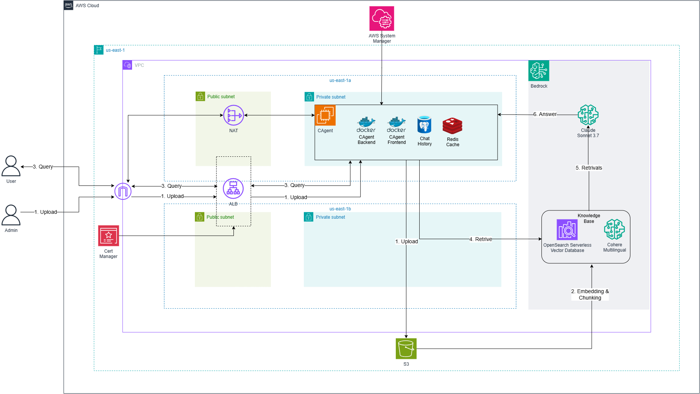

# Terraform Sample Format

This repository demonstrates a structured Terraform configuration for deploying a sophisticated AWS infrastructure with Bedrock Knowledge Base integration.

## Architecture Overview



The infrastructure consists of the following components:

### Network Layer
- VPC with public and private subnets across multiple availability zones
- NAT Gateway for private subnet internet access
- Application Load Balancer (ALB) for traffic distribution

### Compute Layer
- EC2 instances running in private subnets
- Docker containers

### AI/ML Components
- AWS Bedrock with Claude 3.7 Sonnet integration
- Knowledge Base powered by:
  - OpenSearch Serverless Vector Database
  - Cohere Multilingual for embeddings
- S3 bucket for document storage

### Security & Management
- AWS Systems Manager for instance management
- Certificate Manager for SSL/TLS
- IAM roles and policies for secure access
- Security Groups for network access control


## Prerequisites

1. AWS Account with appropriate permissions
2. Installed tools:
   - AWS CLI v2 or later
   - Terraform >= 1.0
   - Git

3. Required AWS services access:
   - EC2
   - VPC
   - S3
   - AWS Bedrock
   - OpenSearch Serverless
   - Systems Manager
   - IAM
   - Certificate Manager

## Getting Started

1. Clone the repository:
```bash
git clone https://github.com/thuatnd-rk/terraform-sample-format.git
cd terraform-sample-format
```

2. Configure AWS credentials:
```bash
aws configure
```

3. Review the deployment plan:
```bash
./terraform.sh <environment> plan
```

4. Apply the configuration:
```bash
./terraform.sh <environment> apply
```

5. Destroy the configuration:
```bash
./terraform.sh <environment> destroy
```

## Environment Configuration

The project supports multiple environments through the `environments/` directory:

- `environments/dev/` - Development environment
- `environments/staging/` - Staging environment
- `environments/prod/` - Production environment

Each environment has its own configuration files:
- `terraform.tfvars` - Environment-specific variables
- `backend.tfvars` - Backend configuration
- `versions.tf` - Provider versions

## Module Documentation

### VPC Module
- Creates VPC with public and private subnets
- Configures NAT Gateways and Internet Gateway
- Sets up routing tables and network ACLs

### EC2 Module
- Provisions EC2 instances in private subnets
- Configures instance profiles and user data
- Sets up auto-scaling configurations

### Bedrock Module
- Configures AWS Bedrock Knowledge Base
- Sets up document processing pipeline
- Manages vector embeddings and retrieval

### OpenSearch Serverless Module
- Creates serverless OpenSearch collection
- Configures vector search capabilities
- Manages access policies and encryption

## Security Features

1. Network Security:
   - Private subnets for sensitive resources
   - Security groups with least privilege access
   - NAT Gateway for outbound internet access

2. Access Control:
   - IAM roles with specific permissions
   - Systems Manager for secure instance access
   - SSL/TLS encryption for data in transit

3. Data Security:
   - Encrypted S3 bucket for document storage
   - OpenSearch encryption at rest
   - Secure secrets management